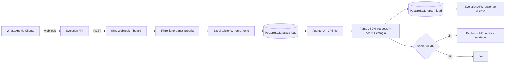

# Bot de Atendimento e Qualificação de Leads — WhatsApp

Automação que atende, responde e qualifica leads no WhatsApp 24/7 usando IA, registra tudo no CRM e dispara o vendedor automaticamente quando o lead esquenta.

---

## Problema resolvido

Lead manda mensagem no WhatsApp fora do horário comercial ou em pico de demanda, ninguém responde a tempo e o lead esfria. A equipe ainda perde horas respondendo as mesmas perguntas. Resultado: lead perdido e custo de aquisição desperdiçado.

## Solução

Fluxo que intercepta cada mensagem recebida, responde com GPT-4o de forma cordial e objetiva, qualifica o lead (necessidade, urgência, orçamento), atribui um score de 0 a 100, grava no CRM (PostgreSQL) e, quando o score passa do limite de corte, notifica o vendedor na hora com o resumo do lead.

---

## Arquitetura



## Stack

| Componente | Ferramenta | Função |
|---|---|---|
| Orquestração | n8n | Fluxo de automação |
| Canal | Evolution API | Envio/recepção WhatsApp |
| IA | OpenAI GPT-4o | Atendimento + qualificação |
| Persistência | PostgreSQL | CRM de leads |
| Notificação | Evolution API | Alerta de lead quente |

## Regras de negócio

1. Mensagens enviadas pela própria instância (`fromMe = true`) são ignoradas — evita loop.
2. Todo lead novo entra com estágio `novo`; a IA reclassifica a cada interação (`qualificando`, `qualificado`, `descartado`).
3. O histórico é acumulado por lead (concatenação), dando contexto à IA em mensagens seguintes.
4. Score >= 70 dispara notificação imediata ao vendedor. O limite é parametrizável no nó `Lead Qualificado?`.
5. A IA é instruída a nunca inventar preço ou prazo — só usa o que estiver no histórico/base.

## Modelo de dados (DDL)

```sql
CREATE TABLE leads (
    id            BIGSERIAL PRIMARY KEY,
    telefone      VARCHAR(20) UNIQUE NOT NULL,
    nome          VARCHAR(120),
    score         SMALLINT DEFAULT 0,
    estagio       VARCHAR(20) DEFAULT 'novo',
    resumo        TEXT,
    historico     TEXT,
    criado_em     TIMESTAMP DEFAULT NOW(),
    atualizado_em TIMESTAMP DEFAULT NOW()
);

CREATE INDEX idx_leads_estagio ON leads (estagio);
CREATE INDEX idx_leads_score   ON leads (score DESC);
```

## Checklist de configuração

- [ ] Subir n8n (Docker ou n8n Cloud) e importar o JSON
- [ ] Criar credencial PostgreSQL (`PostgreSQL - CRM`) e rodar o DDL acima
- [ ] Criar credencial OpenAI via Header Auth: `Authorization: Bearer SUA_API_KEY`
- [ ] Criar credencial Evolution API via Header Auth: `apikey: SUA_CHAVE`
- [ ] Substituir `https://SUA-EVOLUTION-API.com` pela URL real da instância
- [ ] Substituir `55SEU_NUMERO_VENDEDOR` pelo número que recebe os alertas
- [ ] Configurar o webhook da Evolution API apontando para a URL do nó Webhook do n8n
- [ ] Ativar o workflow e testar com uma mensagem real

## Complexidade de implementação

**Média.** Integração de 3 APIs + banco. Tempo estimado de entrega: 2 a 4 dias.

---

## TEXTO PARA O PORTFÓLIO (colar na plataforma)

**Título:** Bot de Atendimento e Qualificação de Leads no WhatsApp com IA

**Descrição:**
Automação completa de atendimento no WhatsApp que responde clientes 24/7 com
IA (GPT-4o), qualifica cada lead automaticamente — identificando necessidade,
urgência e orçamento — e atribui um score de prioridade. Leads quentes disparam
notificação imediata ao vendedor, e todo o histórico fica registrado no CRM.

Resultado: zero lead sem resposta, equipe livre de perguntas repetitivas e
priorização automática de quem está pronto para comprar.

Stack: n8n, Evolution API (WhatsApp), OpenAI GPT-4o, PostgreSQL.
Entrega: fluxo importável, banco modelado e documentação técnica completa.

> Observação: não cole a URL da Evolution API nem números reais no portfólio —
> as plataformas bloqueiam dados de contato. Use prints do fluxo e do bot
> respondendo (com dados fictícios) como evidência visual.
