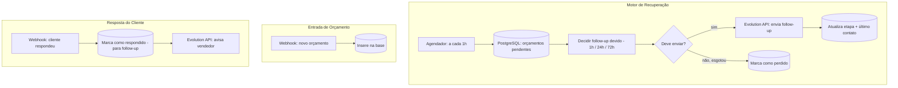

# Recuperação Automática de Orçamentos — WhatsApp

Automação que persegue sozinha cada orçamento enviado e sem resposta, com follow-ups programados e em tom humano, até o cliente responder ou o prazo esgotar. Recupera venda que morreria na gaveta — sem ninguém precisar lembrar.

---

## Problema resolvido

O maior vazamento de receita não é o lead que não chega: é o orçamento que foi enviado e o cliente sumiu. A equipe não cobra por estar ocupada ou por receio de parecer insistente, e a oportunidade esfria. É dinheiro que quase entrou e evaporou sem registro.

## Solução

Um motor de follow-up que roda de hora em hora, identifica os orçamentos pendentes e dispara a mensagem certa no tempo certo — 1h, 24h e 72h após o último contato. Se o cliente responde, os follow-ups param automaticamente e o vendedor é avisado. Se ninguém responde após a sequência, o orçamento é marcado como perdido para não poluir a base.

---

## Arquitetura



## Stack

| Componente | Ferramenta | Função |
|---|---|---|
| Orquestração | n8n | Fluxo + agendador |
| Gatilho de tempo | Schedule Trigger | Varredura horária |
| Canal | Evolution API | Envio WhatsApp |
| Persistência | PostgreSQL | Base de orçamentos |

## Regras de negócio

1. Cada orçamento entra com `status = 'pendente'` e `etapa_followup = 0`.
2. A cada hora, o sistema calcula o tempo desde o último contato e dispara o follow-up devido:
   - **Etapa 1 (após 1h):** confirmação de recebimento.
   - **Etapa 2 (após 24h):** oferta de ajuste/esclarecimento.
   - **Etapa 3 (após 72h):** reserva de condições + saída elegante.
3. As mensagens têm tom humano e consultivo — nunca cobrança robótica.
4. Se o cliente responde a qualquer momento, o `status` vira `respondido`, os follow-ups param e o vendedor é notificado.
5. Após a etapa 3 sem resposta, o orçamento é marcado como `perdido` (encerra o ciclo).
6. O motor é idempotente: roda de hora em hora sem duplicar disparos, porque cada envio avança a etapa e atualiza o `ultimo_contato`.

## Modelo de dados (DDL)

```sql
CREATE TABLE orcamentos (
    id             BIGSERIAL PRIMARY KEY,
    cliente        VARCHAR(120),
    telefone       VARCHAR(20) NOT NULL,
    descricao      TEXT,
    valor          NUMERIC(12,2),
    status         VARCHAR(20) DEFAULT 'pendente',  -- pendente | respondido | perdido | fechado
    etapa_followup SMALLINT DEFAULT 0,              -- 0 | 1 | 2 | 3
    enviado_em     TIMESTAMP DEFAULT NOW(),
    ultimo_contato TIMESTAMP DEFAULT NOW(),
    atualizado_em  TIMESTAMP DEFAULT NOW()
);

CREATE INDEX idx_orc_status ON orcamentos (status);
CREATE INDEX idx_orc_followup ON orcamentos (status, ultimo_contato);
```

## Como alimentar a base

Dois caminhos para registrar um orçamento enviado:

1. **Webhook `/novo-orcamento`** — dispare deste endpoint a partir do seu sistema/planilha no momento em que o orçamento é enviado. Corpo esperado:
   ```json
   { "cliente": "João Silva", "telefone": "5571999999999", "descricao": "Projeto X", "valor": 2500.00 }
   ```
2. **Manual/integração** — qualquer INSERT na tabela `orcamentos` entra no ciclo automaticamente.

## Checklist de configuração

- [ ] Importar o JSON no n8n
- [ ] Criar a tabela com o DDL acima na credencial `PostgreSQL - CRM`
- [ ] Configurar credenciais OpenAI/Evolution (mesmas da peça 1)
- [ ] Substituir `https://SUA-EVOLUTION-API.com/...SUA_INSTANCIA` pela URL real
- [ ] Substituir `55SEU_NUMERO_VENDEDOR`
- [ ] Apontar o webhook da Evolution API (resposta de cliente) para `/orcamento-resposta`
- [ ] Ajustar os tempos (1h/24h/72h) e os textos conforme o negócio do cliente
- [ ] Ativar o workflow e validar com um orçamento de teste

## Complexidade de implementação

**Média.** Lógica de agendamento + estado em banco + 3 gatilhos. Tempo estimado: 3 a 5 dias.

---

## TEXTO PARA O PORTFÓLIO (colar na plataforma)

**Título:** Recuperação Automática de Orçamentos no WhatsApp

**Descrição:**
Automação que acompanha cada orçamento enviado e, sem ninguém precisar lembrar,
faz o follow-up no tempo certo (1h, 24h e 72h) com mensagens em tom humano — não
cobrança robótica. Quando o cliente responde, a sequência para sozinha e o
vendedor é avisado na hora. Orçamentos sem retorno são encerrados automaticamente,
mantendo a base limpa.

Resultado: vendas que morreriam na gaveta voltam a responder, sem esforço manual
da equipe e sem o constrangimento de "ficar cobrando".

Stack: n8n (agendador), Evolution API (WhatsApp), PostgreSQL.
Entrega: fluxo importável, base modelada e documentação técnica completa.

> Observação: nos prints do portfólio, use dados fictícios e não exponha URL da
> Evolution API nem números reais — as plataformas bloqueiam dados de contato.
